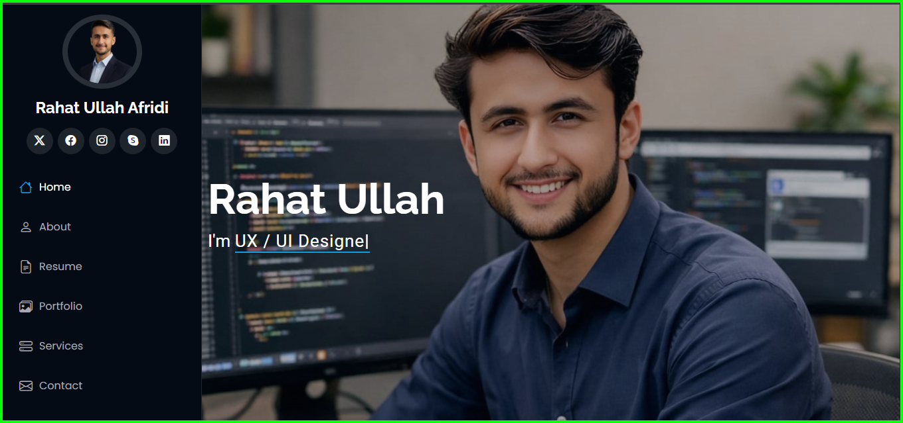

<div align="center">

  

  <h1>Rahat Ullah — Portfolio</h1>

  <p>A modern, fully responsive personal portfolio website built with HTML, CSS & JavaScript.</p>

  <a href="https://rahatullahdev.vercel.app" target="_blank">
    
  </a>
  &nbsp;
  <a href="https://github.com/rahatullah-dev" target="_blank">
    
  </a>
  &nbsp;
  

</div>

---

## Preview



---

## Features

- **Page Loader** — smooth branded intro animation on every visit
- **Scroll Progress Bar** — real-time reading indicator at the top
- **Custom Cursor** — two-layer dot + ring cursor with hover & click states
- **Sticky Navbar** — compact on scroll with active link highlighting
- **Mobile Menu** — slide-in drawer with overlay, keyboard & Escape key support
- **Hero Section** — typed text animation cycling through roles
- **Skills Section** — icon-based skill cards with hover animations
- **Services Section** — clean service cards layout
- **Projects Section** — project cards with live preview & GitHub links
- **Testimonials Carousel** — infinite auto-sliding carousel with dot navigation
- **Pricing Section** — tiered pricing cards with contact form auto-fill
- **Contact Form** — EmailJS powered with loading state & success/error feedback
- **WhatsApp Float Button** — quick contact shortcut
- **Scroll-to-Top Button** — appears after scrolling down
- **Fully Responsive** — optimized for all screen sizes

---

## Tech Stack

| Technology | Purpose |
|---|---|
| HTML5 | Structure & semantics |
| CSS3 | Styling, animations, responsive layout |
| JavaScript (ES6+) | Interactivity & DOM manipulation |
| [EmailJS](https://www.emailjs.com/) | Contact form email delivery |
| [Font Awesome 6](https://fontawesome.com/) | Icons |
| [Google Fonts — Inter](https://fonts.google.com/specimen/Inter) | Typography |
| [Tailwind CSS](https://tailwindcss.com/) | Utility classes |
| [Vercel](https://vercel.com/) | Deployment |

---

## Project Structure

```
portfolio/
├── assets/
│   ├── images/          # All project & profile images
│   ├── Rahat_Ullah_CV_01.pdf
│   └── Rahat_Ullah_CV.docx
├── css/
│   └── style.css        # Main stylesheet
├── js/
│   └── script.js        # All JavaScript logic
├── index.html           # Main portfolio page
├── projects.html        # Extended projects page
└── README.md
```

---

## Getting Started

No build tools or dependencies required. Just clone and open.

```bash
git clone https://github.com/rahatullah-dev/portfolio.git
cd portfolio
```

Then open `index.html` in your browser — or use the [Live Server](https://marketplace.visualstudio.com/items?itemName=ritwickdey.LiveServer) extension in VS Code.

---

## Contact

| Platform | Link |
|---|---|
| Email | rahatullah.dev@gmail.com |
| LinkedIn | [linkedin.com/in/rahat-ullah-a0675a297](https://www.linkedin.com/in/rahat-ullah-a0675a297) |
| GitHub | [github.com/rahatullah-dev](https://github.com/rahatullah-dev) |
| Twitter / X | [x.com/rahatullah_dev](https://x.com/rahatullah_dev) |

---

<div align="center">
  <p>Designed & built by <strong>Rahat Ullah</strong> — Peshawar, Pakistan</p>
</div>
